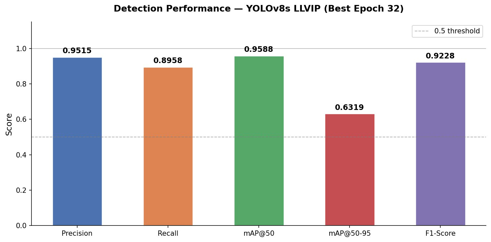
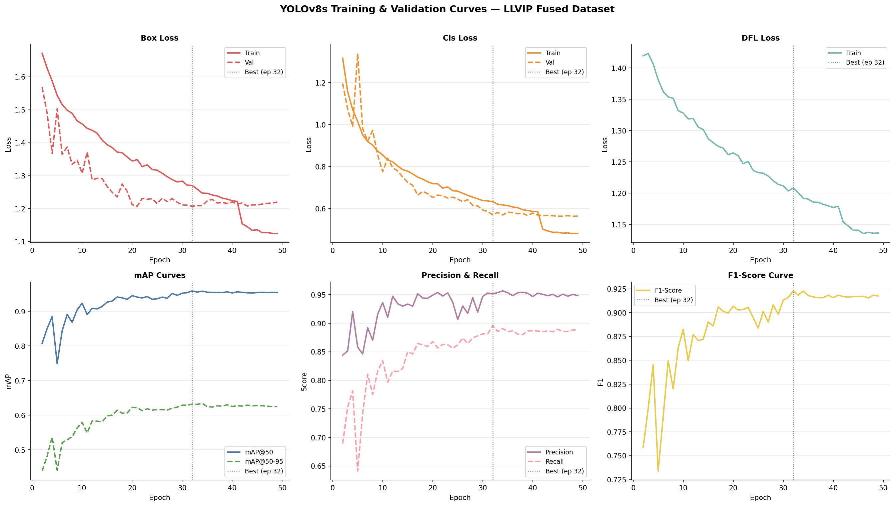
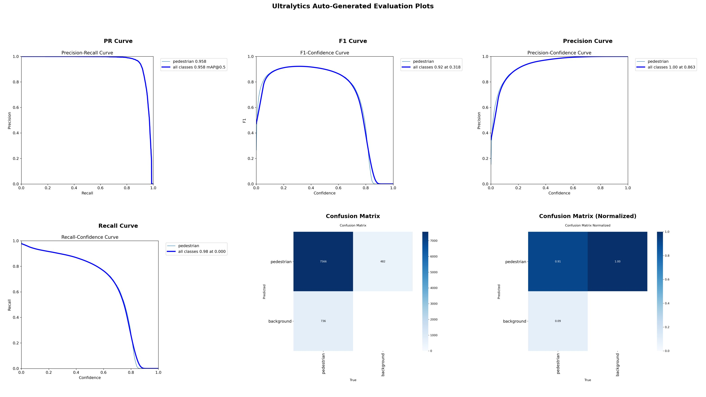
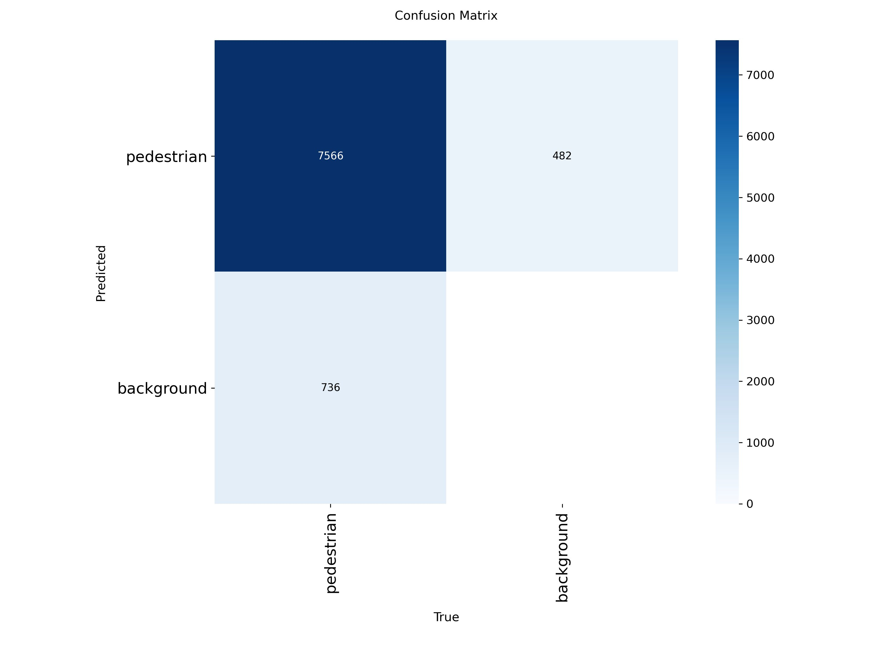
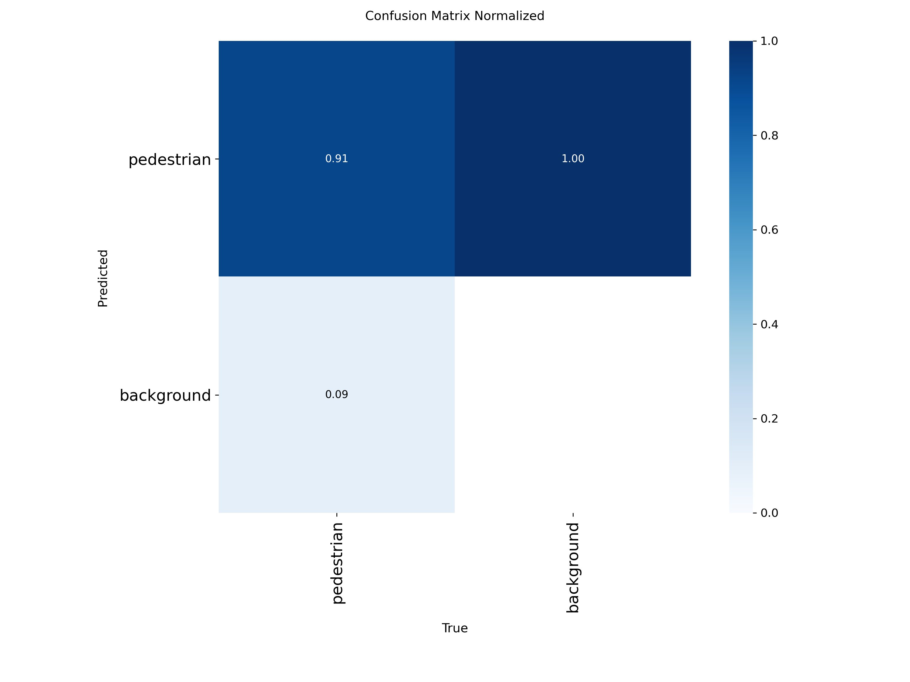
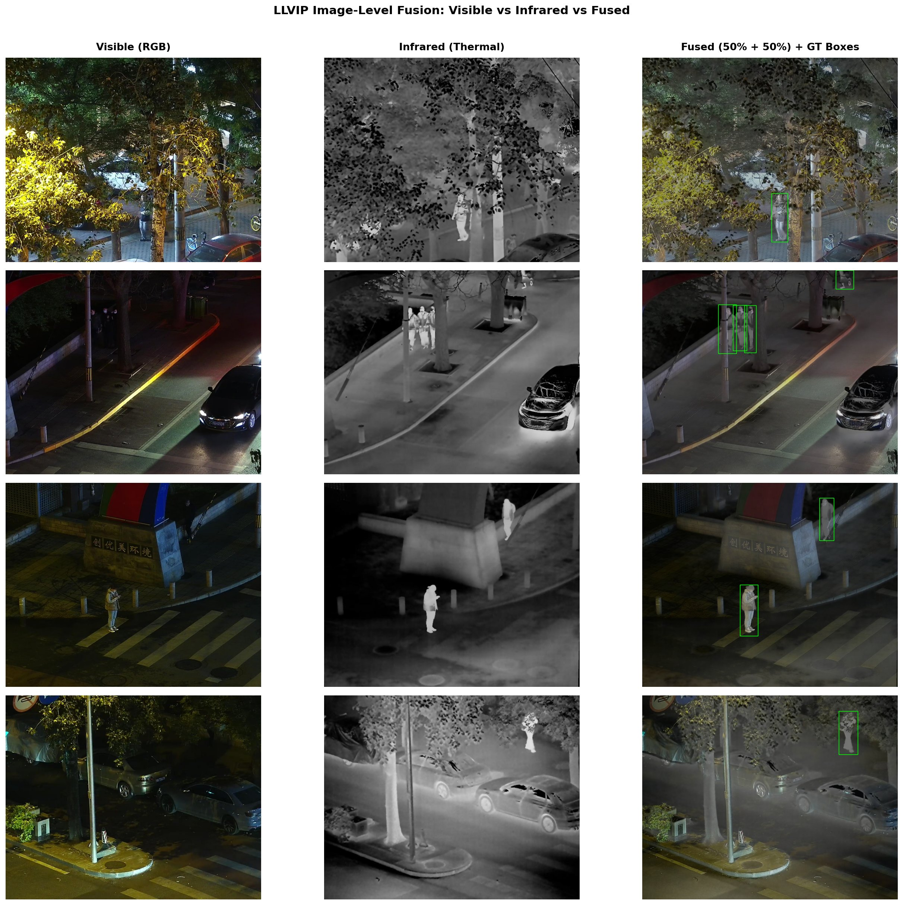

# 🔦 Phát hiện Người đi bộ trong Điều kiện Ánh sáng yếu qua Dung hợp Ảnh Khả kiến - Hồng ngoại + YOLOv8

[](https://www.python.org/)
[](https://github.com/ultralytics/ultralytics)
[](LICENSE)
[](https://bupt-ai-cz.github.io/LLVIP/)
[](https://www.kaggle.com/)

Phát hiện người đi bộ trong môi trường ánh sáng yếu bằng cách sử dụng phương pháp **dung hợp ảnh cấp độ pixel** từ hai miền ảnh khả kiến (RGB) và hồng ngoại (IR), tiến hành tinh chỉnh (fine-tune) mô hình **YOLOv8s** trên bộ dữ liệu chuẩn **LLVIP**.

---

## 📌 Mục lục

- [Giới thiệu](#giới-thiệu)
- [Mục tiêu](#mục-tiêu)
- [Kiến trúc Hệ thống](#kiến-trúc-hệ-thống)
- [Bộ dữ liệu](#bộ-dữ-liệu)
- [Tiền xử lý Dữ liệu](#tiền-xử-lý-dữ-liệu)
- [Kiến trúc Mô hình](#kiến-trúc-mô-hình)
- [Quy trình Huấn luyện](#quy-trình-huấn-luyện)
- [Các chỉ số Đánh giá](#các-chỉ-số-đánh-giá)
- [Kết quả Thực nghiệm](#kết-quả-thực-nghiệm)
- [Cài đặt](#cài-đặt)
- [Hướng dẫn Sử dụng](#hướng-dẫn-sử-dụng)
  - [Chuẩn bị Dữ liệu](#chuẩn-bị-dữ-liệu)
  - [Chạy Huấn luyện](#chạy-huấn-luyện)
  - [Chạy Dự đoán](#chạy-dự-đoán)
  - [Huấn luyện lại từ đầu](#huấn-luyện-lại-từ-đầu)
  - [Khởi chạy Gradio Demo](#khởi-chạy-gradio-demo)
- [Cấu trúc Dự án](#cấu-trúc-dự-án)
- [Giao diện Gradio Demo](#giao-diện-gradio-demo)
- [Hạn chế](#hạn-chế)
- [Hướng phát triển Tương lai](#hướng-phát-triển-tương-lai)
- [Trích dẫn](#trích-dẫn)
- [Giấy phép](#giấy-phép)

---

## Giới thiệu

Các camera RGB thông thường bị suy giảm chất lượng nghiêm trọng trong bóng tối, khiến việc phát hiện người đi bộ vào ban đêm trở thành một thách thức lớn đối với các hệ thống lái xe tự động, giám sát an ninh và an toàn công cộng. Tuy nhiên, camera hồng ngoại lại có khả năng thu bức xạ nhiệt và hoạt động hiệu quả bất kể điều kiện chiếu sáng.

Dự án này đề xuất một **quy trình dung hợp dữ liệu đa miền** nhằm trộn ảnh ánh sáng khả kiến và ảnh hồng ngoại ở cấp độ pixel (trộn alpha theo trọng số), sau đó huấn luyện **YOLOv8s** — một mô hình phát hiện vật thể thời gian thực tiên tiến hiện nay — trên các ảnh đã dung hợp thuộc bộ dữ liệu **LLVIP** (Low-Light Visible-Infrared Paired).

---

## Mục tiêu

- Triển khai một quy trình dung hợp ảnh đa miền có tính tái lặp cao phục vụ bài toán phát hiện người đi bộ trong đêm tối.
- Chuyển đổi định dạng nhãn từ Pascal VOC XML sang định dạng YOLO để tích hợp mượt mà với thư viện Ultralytics.
- Tinh chỉnh mô hình YOLOv8s trên dữ liệu ảnh dung hợp khả kiến - hồng ngoại.
- Đánh giá hiệu suất phát hiện dựa trên các chỉ số chuẩn COCO (mAP@50, mAP@50-95, Precision, Recall, F1-Score).
- Cung cấp một giao diện tương tác trực quan bằng Gradio để dự đoán thời gian thực.

---

## Kiến trúc Hệ thống
```
Bộ dữ liệu LLVIP
├── Ảnh Khả kiến (RGB)      ─────────────────────────────────────────┐
└── Ảnh Hồng ngoại (IR)     ────── Trộn Alpha (α=0.5, β=0.5) ────────► Ảnh Dung hợp
│
Nhãn LLVIP (VOC XML)    ──── parse_voc_xml_to_yolo() ────────────────► Nhãn YOLO (.txt)
│
YOLOv8s Tiền huấn luyện (COCO)            │
│                                  │
└─── Tinh chỉnh trên Dữ liệu ◄─────┘
│
best.pt / last.pt
│
Dự đoán (conf=0.25, IoU=0.45)
│
Kết quả Phát hiện + Gradio Demo
```

---

---

## Bộ dữ liệu

**LLVIP** (Low-Light Visible-Infrared Paired) là bộ dữ liệu chuẩn được thiết kế riêng cho bài toán phát hiện người trong điều kiện ánh sáng yếu.

| Thuộc tính | Giá trị |
|---|---|
| **Tổng số lượng ảnh** | 30.976 ảnh ghép cặp (15.488 cảnh) |
| **Tập Huấn luyện (Train)** | ~12.025 ảnh (Chiếm 85% tập huấn luyện gốc của LLVIP) |
| **Tập Kiểm thử (Val/Test)** | ~2.122 ảnh (Chiếm 15% tập huấn luyện gốc + tập test chính thức) |
| **Độ phân giải** | 1280 × 1024 pixels |
| **Các miền dữ liệu** | Khả kiến (RGB) + Hồng ngoại (Nhiệt) |
| **Các lớp đối tượng** | 1 — `person` (bao gồm cả `pedestrian`) |
| **Định dạng nhãn gốc** | Pascal VOC XML |
| **Nguồn dữ liệu** | [LLVIP Official](https://bupt-ai-cz.github.io/LLVIP/) |

Tất cả các cặp ảnh đối ứng đều chia sẻ chung tên tệp giống nhau giữa các thư mục ảnh khả kiến và hồng ngoại.

---

## Tiền xử lý Dữ liệu

### 1. Dung hợp Ảnh

Mỗi cặp ảnh khả kiến - hồng ngoại được dung hợp bằng phương pháp **trộn alpha theo trọng số (weighted alpha blending)**:

```
Fused = α × Visible_BGR + β × Infrared_as_BGR
```
Dưới đây là toàn bộ nội dung tệp README.md bằng tiếng Việt được đặt trong khối mã để bạn sao chép trực tiếp vào mã nguồn của mình:

Markdown
# 🔦 Phát hiện Người đi bộ trong Điều kiện Ánh sáng yếu qua Dung hợp Ảnh Khả kiến - Hồng ngoại + YOLOv8

[](https://www.python.org/)
[](https://github.com/ultralytics/ultralytics)
[](LICENSE)
[](https://bupt-ai-cz.github.io/LLVIP/)
[](https://www.kaggle.com/)

Phát hiện người đi bộ trong môi trường ánh sáng yếu bằng cách sử dụng phương pháp **dung hợp ảnh cấp độ pixel** từ hai miền ảnh khả kiến (RGB) và hồng ngoại (IR), tiến hành tinh chỉnh (fine-tune) mô hình **YOLOv8s** trên bộ dữ liệu chuẩn **LLVIP**.

---

## 📌 Mục lục

- [Giới thiệu](#giới-thiệu)
- [Mục tiêu](#mục-tiêu)
- [Kiến trúc Hệ thống](#kiến-trúc-hệ-thống)
- [Bộ dữ liệu](#bộ-dữ-liệu)
- [Tiền xử lý Dữ liệu](#tiền-xử-lý-dữ-liệu)
- [Kiến trúc Mô hình](#kiến-trúc-mô-hình)
- [Quy trình Huấn luyện](#quy-trình-huấn-luyện)
- [Các chỉ số Đánh giá](#các-chỉ-số-đánh-giá)
- [Kết quả Thực nghiệm](#kết-quả-thực-nghiệm)
- [Cài đặt](#cài-đặt)
- [Hướng dẫn Sử dụng](#hướng-dẫn-sử-dụng)
  - [Chuẩn bị Dữ liệu](#chuẩn-bị-dữ-liệu)
  - [Chạy Huấn luyện](#chạy-huấn-luyện)
  - [Chạy Dự đoán](#chạy-dự-đoán)
  - [Huấn luyện lại từ đầu](#huấn-luyện-lại-từ-đầu)
  - [Khởi chạy Gradio Demo](#khởi-chạy-gradio-demo)
- [Cấu trúc Dự án](#cấu-trúc-dự-án)
- [Giao diện Gradio Demo](#giao-diện-gradio-demo)
- [Hạn chế](#hạn-chế)
- [Hướng phát triển Tương lai](#hướng-phát-triển-tương-lai)
- [Trích dẫn](#trích-dẫn)
- [Giấy phép](#giấy-phép)

---

## Giới thiệu

Các camera RGB thông thường bị suy giảm chất lượng nghiêm trọng trong bóng tối, khiến việc phát hiện người đi bộ vào ban đêm trở thành một thách thức lớn đối với các hệ thống lái xe tự động, giám sát an ninh và an toàn công cộng. Tuy nhiên, camera hồng ngoại lại có khả năng thu bức xạ nhiệt và hoạt động hiệu quả bất kể điều kiện chiếu sáng.

Dự án này đề xuất một **quy trình dung hợp dữ liệu đa miền** nhằm trộn ảnh ánh sáng khả kiến và ảnh hồng ngoại ở cấp độ pixel (trộn alpha theo trọng số), sau đó huấn luyện **YOLOv8s** — một mô hình phát hiện vật thể thời gian thực tiên tiến hiện nay — trên các ảnh đã dung hợp thuộc bộ dữ liệu **LLVIP** (Low-Light Visible-Infrared Paired).

---

## Mục tiêu

- Triển khai một quy trình dung hợp ảnh đa miền có tính tái lặp cao phục vụ bài toán phát hiện người đi bộ trong đêm tối.
- Chuyển đổi định dạng nhãn từ Pascal VOC XML sang định dạng YOLO để tích hợp mượt mà với thư viện Ultralytics.
- Tinh chỉnh mô hình YOLOv8s trên dữ liệu ảnh dung hợp khả kiến - hồng ngoại.
- Đánh giá hiệu suất phát hiện dựa trên các chỉ số chuẩn COCO (mAP@50, mAP@50-95, Precision, Recall, F1-Score).
- Cung cấp một giao diện tương tác trực quan bằng Gradio để dự đoán thời gian thực.

---

## Kiến trúc Hệ thống

Bộ dữ liệu LLVIP
├── Ảnh Khả kiến (RGB)      ─────────────────────────────────────────┐
└── Ảnh Hồng ngoại (IR)     ────── Trộn Alpha (α=0.5, β=0.5) ────────► Ảnh Dung hợp
│
Nhãn LLVIP (VOC XML)    ──── parse_voc_xml_to_yolo() ────────────────► Nhãn YOLO (.txt)
│
YOLOv8s Tiền huấn luyện (COCO)            │
│                                  │
└─── Tinh chỉnh trên Dữ liệu ◄─────┘
│
best.pt / last.pt
│
Dự đoán (conf=0.25, IoU=0.45)
│
Kết quả Phát hiện + Gradio Demo


---

## Bộ dữ liệu

**LLVIP** (Low-Light Visible-Infrared Paired) là bộ dữ liệu chuẩn được thiết kế riêng cho bài toán phát hiện người trong điều kiện ánh sáng yếu.

| Thuộc tính | Giá trị |
|---|---|
| **Tổng số lượng ảnh** | 30.976 ảnh ghép cặp (15.488 cảnh) |
| **Tập Huấn luyện (Train)** | ~12.025 ảnh (Chiếm 85% tập huấn luyện gốc của LLVIP) |
| **Tập Kiểm thử (Val/Test)** | ~2.122 ảnh (Chiếm 15% tập huấn luyện gốc + tập test chính thức) |
| **Độ phân giải** | 1280 × 1024 pixels |
| **Các miền dữ liệu** | Khả kiến (RGB) + Hồng ngoại (Nhiệt) |
| **Các lớp đối tượng** | 1 — `person` (bao gồm cả `pedestrian`) |
| **Định dạng nhãn gốc** | Pascal VOC XML |
| **Nguồn dữ liệu** | [LLVIP Official](https://bupt-ai-cz.github.io/LLVIP/) |

Tất cả các cặp ảnh đối ứng đều chia sẻ chung tên tệp giống nhau giữa các thư mục ảnh khả kiến và hồng ngoại.

---

## Tiền xử lý Dữ liệu

### 1. Dung hợp Ảnh

Mỗi cặp ảnh khả kiến - hồng ngoại được dung hợp bằng phương pháp **trộn alpha theo trọng số (weighted alpha blending)**:

Fused = α × Visible_BGR + β × Infrared_as_BGR


- Sử dụng tỷ lệ `α = 0.5`, `β = 0.5` (đóng góp đồng đều từ cả hai miền ảnh).
- Ảnh hồng ngoại (ảnh xám) được chuyển đổi sang định dạng 3 kênh BGR trước khi thực hiện trộn.
- Các ảnh được căn chỉnh không gian bằng cách thay đổi kích thước ảnh hồng ngoại khớp với độ phân giải ảnh khả kiến.

### 2. Chuyển đổi Định dạng Nhãn

Các nhãn định dạng VOC XML được chuyển đổi sang cấu trúc YOLO:

```
<class_id> <cx> <cy> <bw> <bh>   (all values normalized to [0,1])
```
- Chỉ giữ lại các nhãn thuộc lớp `person` và `pedestrian` (được ánh xạ về ID lớp `0`).
- Các hộp bao (Bounding box) được cắt gọn theo ranh giới của ảnh trước khi chuẩn hóa.

### 3. Phân chia Tập dữ liệu

- 85% tập huấn luyện chính thức của LLVIP được đưa vào cấu phần huấn luyện (Training).
- 15% tập huấn luyện chính thức của LLVIP được dùng làm tập kiểm định (Validation).
- Tập thử nghiệm chính thức của LLVIP được giữ nguyên cho khâu đánh giá cuối cùng.

---

## Kiến trúc Mô hình

Dự án sử dụng cấu hình **YOLOv8s** (Phiên bản cỡ nhỏ của dòng mô hình YOLOv8 phát triển bởi Ultralytics):

| Thành phần | Chi tiết |
|---|---|
| **Mạng xương sống (Backbone)** | CSPDarknet tích hợp các mô-đun C2f |
| **Mạng cổ (Neck)** | PANet (Path Aggregation Network) |
| **Đầu phát hiện (Head)** | Đầu phát hiện tách rời (Decoupled head) |
| **Kích thước đầu vào** | 640 × 640 |
| **Số lượng tham số** | ~11.2M |
| **Trọng số tiền huấn luyện** | COCO (80 lớp) |
| **Lớp đối tượng tinh chỉnh** | 1 (`person`) |

---

## Quy trình Huấn luyện

| Siêu tham số | Giá trị |
|---|---|
| **Số chu kỳ (Epochs)** | 50 |
| **Kích thước lô (Batch Size)** | 16 |
| **Kích thước ảnh** | 640 |
| **Thuật toán tối ưu (Optimizer)** | AdamW |
| **Tốc độ học ban đầu (`lr0`)** | 0.01 |
| **Tốc độ học cuối cùng (`lrf`)** | 0.001 |
| **Lịch trình giảm tốc độ học** | Cosine annealing |
| **Hệ số suy giảm trọng số** | 5e-4 |
| **Chu kỳ khởi động (Warmup Epochs)** | 3 |
| **Độ kiên nhẫn dừng sớm (Patience)** | 15 |
| **Số luồng xử lý (Workers)** | 4 |
| **Sử dụng trọng số nền** | Có (COCO) |

---

## Các chỉ số Đánh giá

Các chỉ số được tính toán thông qua quy trình kiểm định tiêu chuẩn của thư viện Ultralytics (theo chuẩn COCO):

| Chỉ số | Mô tả |
|---|---|
| **Precision** | Tỷ lệ chính xác: TP / (TP + FP) tính tại mức IoU ≥ 0.50 |
| **Recall** | Độ bao phủ: TP / (TP + FN) tính tại mức IoU ≥ 0.50 |
| **mAP@50** | Độ chính xác trung bình trung bình tại ngưỡng IoU = 0.50 |
| **mAP@50-95** | Độ chính xác trung bình trung bình trên các ngưỡng IoU từ [0.50:0.05:0.95] |
| **F1-Score** | Trung bình điều hòa giữa Precision và Recall |

Ngưỡng thiết lập khi chạy dự đoán: `conf=0.25`, `iou=0.45`.

---

## Kết quả Thực nghiệm

> Mô hình YOLOv8s được tinh chỉnh trên bộ dữ liệu dung hợp khả kiến - hồng ngoại LLVIP — **đạt điểm checkpoint tốt nhất tại epoch thứ 32** (Tổng 50 epochs, tối ưu bằng AdamW, giảm LR theo Cosine).

| Chỉ số | Giá trị |
|---|---|
| **Precision** | **0.9515** |
| **Recall** | **0.8958** |
| **mAP@50** | **0.9588** |
| **mAP@50-95** | **0.6319** |
| **F1-Score** | **0.9228** |

> Ngưỡng tin cậy (Confidence Threshold) tốt nhất cho chỉ số F1 là **0.318**. Precision đạt giá trị tuyệt đối 1.00 tại ngưỡng conf 0.863, trong khi Recall đạt tới 0.98 ở các mức tin cậy thấp.

### Tóm tắt Hiệu suất Phát hiện


### Đường cong Huấn luyện & Kiểm thử


### Các biểu đồ đánh giá hệ thống (PR / F1 / Precision / Recall)


### Ma trận nhầm lẫn (Confusion Matrix)
| Đếm số lượng thô | Dạng chuẩn hóa (%) |
|---|---|
|  |  |

### Trực quan hóa kết quả dung hợp (Khả kiến vs Hồng ngoại vs Ảnh Dung hợp + Khung BBox thực tế)


---

## Cài đặt

### Yêu cầu hệ thống

- Python 3.10 trở lên
- Card đồ họa GPU hỗ trợ CUDA (Khuyên dùng, hệ thống đã được thử nghiệm tốt trên dòng T4/P100 của Kaggle)
- Bộ nhớ RAM từ 16GB trở lên

### Thiết lập môi trường

```bash
git clone [https://github.com/Nhdnguyenhoangduc/llvip-pedestrian-detection.git](https://github.com/Nhdnguyenhoangduc/llvip-pedestrian-detection.git)
cd llvip-pedestrian-detection

pip install -r requirements.txt
```

---

## Usage

### Chuẩn bị Dữ liệu

Tải bộ dữ liệu LLVIP từ [official source](https://bupt-ai-cz.github.io/LLVIP/) và tổ chức cấu trúc thư mục như sau:

```
data/
└── LLVIP/
    ├── visible/
    │   ├── train/   # RGB training images
    │   └── test/    # RGB test images
    ├── infrared/
    │   ├── train/   # IR training images
    │   └── test/    # IR test images
    └── Annotations/ # VOC XML files
```

Update paths in the notebook or `configs/paths.yaml`.

### Chạy Huấn luyện

Open and run the notebook end-to-end:

```bash
jupyter notebook notebooks/ai-predict-humman.ipynb
```

Or run on Kaggle by uploading the notebook and attaching the LLVIP dataset.

### Chạy Dự đoán

```python
from ultralytics import YOLO
import cv2

model = YOLO("path/to/best.pt")

# Single image inference
results = model.predict(
    source="path/to/fused_image.jpg",
    conf=0.25,
    iou=0.45,
    imgsz=640,
)
annotated = results[0].plot()
cv2.imwrite("output.jpg", annotated)
```

### Huấn luyện lại từ đầu

1. Thực thi các ô lệnh từ Cell 1 đến Cell 4 để thiết lập môi trường, tiến hành dung hợp ảnh và tạo file nhãn YOLO.
2. Chạy Cell 6 để bắt đầu quá trình tinh chỉnh mô hình YOLOv8s.
3. Chạy Cell 7 để trích xuất các thông số đánh giá.
4. Chạy Cell 8 để xem trực quan các mẫu ảnh dự đoán thực tế.

### Khởi chạy Gradio Demo

```bash
# After training, run the Gradio cell (Cell GUI) in the notebook
# Or run standalone:
python scripts/gradio_demo.py --model_path runs/llvip_fusion_yolov8s/weights/best.pt
```

---

## Cấu trúc Dự án

```
llvip-pedestrian-detection/
├── notebooks/
│   └── ai-predict-humman.ipynb     # Main training & evaluation notebook
├── scripts/
│   └── gradio_demo.py              # Standalone Gradio demo script
├── configs/
│   └── data.yaml                   # YOLO dataset config (auto-generated)
├── docs/
│   ├── results/                    # Training curves, confusion matrix (add manually)
│   └── architecture.png            # System architecture diagram (add manually)
├── assets/
│   └── demo.gif                    # Demo GIF (add manually)
├── README.md
├── MODEL_CARD.md
├── PROJECT_STRUCTURE.md
├── CHANGELOG.md
├── CONTRIBUTING.md
├── requirements.txt
├── .gitignore
└── LICENSE
```

---

## Giao diện Gradio Demo

Mã nguồn trong notebook cung cấp một giao diện web tương tác toàn diện (Cell GUI) hỗ trợ các tính năng:

- **Tải lên một ảnh đơn**: Đưa vào một ảnh khả kiến hoặc ảnh đã dung hợp sẵn để mô hình dự đoán.
- **Tải lên cặp ảnh đối ứng**: Người dùng tải lên đồng thời cả ảnh khả kiến + ảnh hồng ngoại; hệ thống sẽ tự động thực hiện dung hợp thời gian thực rồi đưa vào mô hình nhận diện.
- **Tùy chỉnh linh hoạt**: Thanh trượt cho phép thay đổi trực tiếp các ngưỡng Tin cậy (Confidence) và ngưỡng trùng lắp (IoU).
- **Dự đoán theo lô**: Lấy ngẫu nhiên các mẫu ảnh trong tập kiểm định để hiển thị trực tiếp kết quả kèm hộp bao nhận diện.

---

## Hạn chế

- Chiến lược dung hợp hiện tại (alpha blending) mới dừng lại ở mức xử lý cấp độ pixel đơn giản; việc áp dụng các cơ chế cao cấp hơn (Laplacian pyramid, mạng dung hợp học sâu) hứa hẹn sẽ mang lại kết quả tốt hơn.
- Mô hình được huấn luyện đặc thù trên bộ dữ liệu LLVIP nên khả năng suy rộng (generalization) sang các ngữ cảnh đêm tối khác có thể bị giảm sút nếu không được học bổ sung.
- Hiệu suất nhận diện có xu hướng giảm đối với các trường hợp người đi bộ bị che khuất một phần hoặc có kích thước quá nhỏ (chiều cao mẫu nhỏ hơn 20px).
- Dự án hiện tại chỉ cấu hình nhận diện đơn lớp — mục tiêu duy nhất là lớp person (người).
- Tốc độ suy luận phụ thuộc lớn vào cấu hình phần cứng; việc chạy ứng dụng trên CPU sẽ chậm hơn đáng kể so với môi trường có hỗ trợ GPU.

---

## Hướng phát triển Tương lai

- [ ] Thử nghiệm và tích hợp các phương pháp dung hợp ảnh dựa trên mạng học sâu tiên tiến (ví dụ: DenseFuse, RFN-Nest).
- [ ] Mở rộng bài toán sang hệ thống nhận diện đa lớp (nhận diện thêm phương tiện giao thông, người đi xe đạp).
- [ ] Thực hiện đánh giá so sánh hiệu năng giữa các phiên bản YOLOv8n, YOLOv8m và YOLOv8l.
- [ ] Tích hợp tính năng xuất mô hình sang định dạng TensorRT/ONNX để tối ưu hóa triển khai trên các thiết bị biên (Edge Devices).
- [ ] Ứng dụng các thuật toán theo dõi đối tượng (ByteTrack / BotSort) phục vụ bài toán đếm số lượng người đi bộ qua video.
- [ ] Đánh giá kiểm thử mô hình trên các bộ dữ liệu đa miền đêm tối khác như KAIST hoặc CVC-14.
- [ ] Đóng gói và phát hành các trọng số đã huấn luyện (pretrained weights) lên nền tảng Hugging Face Hub.

---

## Trích dẫn

If you use this work, please cite the LLVIP dataset:

```bibtex
@InProceedings{jia2021llvip,
  title     = {LLVIP: A Visible-infrared Paired Dataset for Low-light Vision},
  author    = {Jia, Xinyu and Zhu, Chuang and Li, Minzhen and Tang, Wenqi and Zhou, Wenli},
  booktitle = {Proceedings of the IEEE/CVF International Conference on Computer Vision (ICCV) Workshops},
  year      = {2021}
}
```

---

## License

This project is licensed under the **MIT License**. See [LICENSE](LICENSE) for details.
